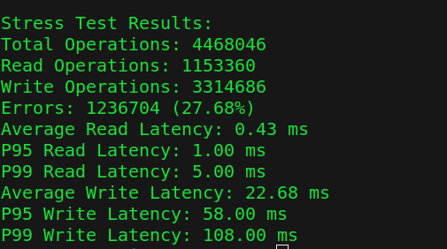

# StashDB: Distributed Key-Value Store
StashDB is a distributed key-value store server built in Go, offering high performance and flexibility. The primary storage engine is **BoltDB**, but it also supports **LevelDB** for users who prefer it. StashDB utilizes the **Raft consensus** algorithm to ensure fault tolerance and high availability across nodes in the cluster. It also provides easy-to-use **gRPC and RESTful APIs** for data interaction.

### Key Features:
* **Storage Engines**: Supports both BoltDB and LevelDB for efficient, persistent key-value storage. Choose the storage engine that best fits your needs.
* **Raft Consensus Algorithm**: Ensures fault tolerance and strong consistency in a distributed environment.
* **gRPC & RESTful APIs**: Interface with StashDB using flexible communication protocols.
* **Database Replication**: Built-in replication to maintain high availability across nodes.
* **Cluster Setup**: Easily deploy and configure distributed clusters.
* **Secure Communication**: Supports secure communication between nodes using TLS.
* **Supported Databases**:
  - **BoltDB**: The default storage engine, read efficient.
  - **LevelDB**: An alternative storage engine for users who write efficient engine. 

### Installation

```bash
$ git clone https://github.com/Bl4ck-h00d/stashdb.git
$ cd stashdb
$ make install
$ sudo mv bin/stash /usr/local/bin/stash
```

### Usage

#### Start a node

```bash
$ stash start --id=node1 --raft-address=127.0.0.1:7000 --grpc-address=:9000 --data-dir=data/node1/ --storage-engine=levels 
```

Get node info

```bash
$ stash node | jq
```

Result:
```json
{
  "node": {
    "raftAddress": "127.0.0.1:7000",
    "metadata": {
      "grpcAddress": ":9000",
      "httpAddress": ":8080"
    },
    "state": "Leader"
  }
}
```

#### Create a bucket

```bash
$ stash create <bucket-name>
```

List all the buckets

```bash
$ stash ls
```

#### Set a Key-Value

```bash
$ stash set <bucket-name> <key> <value>
```

#### Get a Key-Value

```bash
$ stash get <bucket-name> <key>
```

Fetch all the entries in the bucket

```bash
$ stash ls -d <bucket-name>
```

#### Delete a Key-Value

```bash
$ stash delete <bucket-name> <key>
```

#### Cluster [joining cluster at startup]

Node 1:
```bash
$ stash start --id=node1 --raft-address=127.0.0.1:7000 --grpc-address=:9000 --data-dir=data/node1/ --storage-engine=levels
```

Node 2:
```bash
$ stash start --id=node2 --raft-address=127.0.0.1:7002 --grpc-address=:9002 --data-dir=data/node2/ --storage-engine=levels --peer-grpc-address=:9000
```

Node 3:
```bash
$ stash start --id=node3 --raft-address=127.0.0.1:7003 --grpc-address=:9003 --data-dir=data/node3/ --storage-engine=levels --peer-grpc-address=:9000
```

##### Inspect the cluster

```bash
$ stash cluster | jq
```

#### Join

##### Join the node to an already running cluster

```bash
$ stash join node4 127.0.0.1:9004 --grpc-address=<target-port>
```

**NOTE:** 
* The commands will be directed to the node running on gRPC on port :9000. You can specify the gRPC port of your node with `--grpc-address=:9002`
* It is recommended to have **at least 3** nodes or follow a **2n+1** configuration for optimal fault tolerance and consensus.


### Benchmarks

#### Total concurrent users: 1000




#### Work In Progress
* Enabling secure communication
* Making REST API interface better
